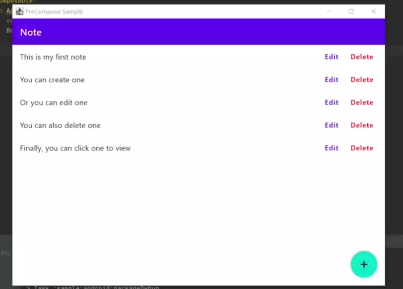
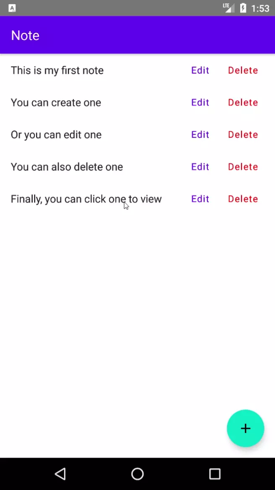
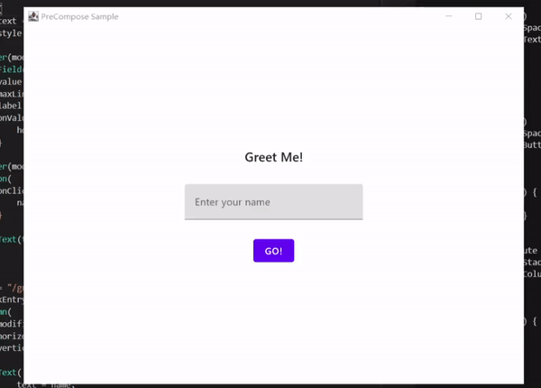

# PreCompose
[](https://jitpack.io/#Tlaster/PreCompose)
[](https://maven-badges.herokuapp.com/maven-central/moe.tlaster/precompose)
[](https://github.com/JetBrains/compose-jb)

Let you write your Kotlin application in pure compose, which is **Pre**tty **Compose**.

PreCompose inspired by Jetpack Lifecycle, ViewModel, LiveData and Navigation. If you're familiar with these components in Android, PreCompose provides similar (or even the same) components for you but it's written in pure Kotlin and it's Kotlin Multiplatform project. Let you enjoy the power of Kotlin and compose, `write once, run everywhere`(like what Flutter does)

# Why PreCompose?
Since compose actually renders itself using skia like what Flutter does, it can be platform-independent with the power of Kotlin Multiplatform. So why not do the things that Flutter does? And get better! Just write your business logic and ui code once in one `commonMain`, and your application can be anywhere, powered by Kotlin and compose!  

There's nothing complex to setup, just write your ViewModel and UI code and you're good to go! Complex things like lifecycle will be handled by PreCompose.

# Setup
[Setup guide for PreCompose](/docs/setup.md)

# Components
 - [Navigation](/docs/component/navigation.md)
 - [LiveData](/docs/component/live_data.md)
 - [ViewModel](/docs/component/view_model.md)

# Sample
## [Note App](/docs/sample.md#note-app)



## [Greetings App with ViewModel in 100 lines!](/docs/sample.md#greetings-app-with-viewmodel-in-100-lines)


# LICENSE
```
MIT License

Copyright (c) 2021 Tlaster

Permission is hereby granted, free of charge, to any person obtaining a copy
of this software and associated documentation files (the "Software"), to deal
in the Software without restriction, including without limitation the rights
to use, copy, modify, merge, publish, distribute, sublicense, and/or sell
copies of the Software, and to permit persons to whom the Software is
furnished to do so, subject to the following conditions:

The above copyright notice and this permission notice shall be included in all
copies or substantial portions of the Software.

THE SOFTWARE IS PROVIDED "AS IS", WITHOUT WARRANTY OF ANY KIND, EXPRESS OR
IMPLIED, INCLUDING BUT NOT LIMITED TO THE WARRANTIES OF MERCHANTABILITY,
FITNESS FOR A PARTICULAR PURPOSE AND NONINFRINGEMENT. IN NO EVENT SHALL THE
AUTHORS OR COPYRIGHT HOLDERS BE LIABLE FOR ANY CLAIM, DAMAGES OR OTHER
LIABILITY, WHETHER IN AN ACTION OF CONTRACT, TORT OR OTHERWISE, ARISING FROM,
OUT OF OR IN CONNECTION WITH THE SOFTWARE OR THE USE OR OTHER DEALINGS IN THE
SOFTWARE.
```